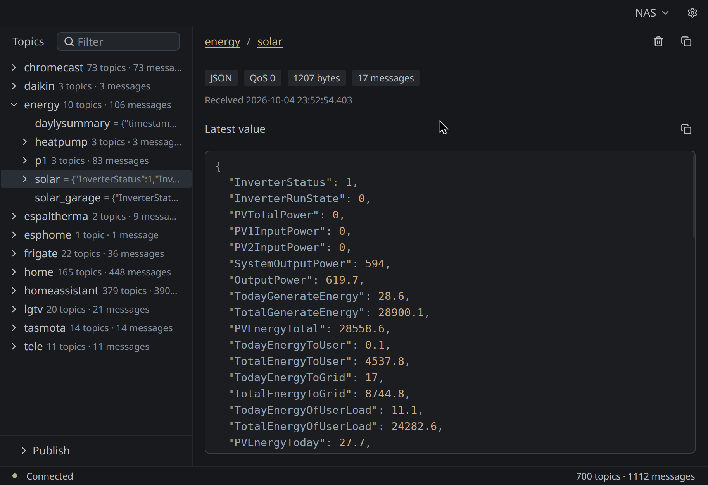

# TopQ

An MQTT 5 topic explorer built with Rust and [GPUI Kit](https://gpui-kit.com).



## Features

- Multiple saved TCP, TLS, WebSocket, and secure WebSocket broker connections with automatic reconnect.
- Live topic tree and latest per-topic payload, shown as formatted JSON, text, or hex, with message metadata and MQTT 5 content type when supplied by the publisher. Additional MQTT 5 properties (payload format, expiry interval, response topic, correlation data, user properties, and subscription identifiers) are preserved in the message model for future UI use.
- Confirmed clearing of retained messages for a selected topic and its known subtopics.
- Publish messages, with fish-style inline topic suggestions from the live topic tree. Suggestions and uniqueness are scoped to the current topic level, like directory completion in a shell; branches include a trailing `/` to continue into the next level. Right Arrow accepts a suggestion; Tab accepts a unique match or cycles through matching siblings without changing the typed text.

Each connection has one or more **Topics** subscriptions, each with its own QoS (0, 1, or 2). New connections default to `#` at QoS 0. Enter MQTT topic filters such as `home/#`, `home/+/temperature`, or `$SYS/#` in the connection settings; duplicate filters are not allowed. The default `#` excludes `$`-prefixed topics such as `$SYS`. All configured filters are subscribed together on every reconnect, and the connection is marked connected only after the broker accepts every subscription. The delete button publishes an empty payload with QoS 0 and retain enabled to each known topic in the selected branch, removing retained messages on the broker. Confirmation is tied to the current connection session; interrupted batches are not retried after reconnect. QoS 0 has no delivery acknowledgement, so deletion cannot be guaranteed. Subscribed clients remove topics and prune empty parent levels when they receive the broker's empty publish. Incoming empty payloads are treated as removals: MQTT 5 cannot reliably distinguish a forwarded retained-message deletion from an ordinary empty publish. This does not stop live publishers, which can recreate retained messages; the live tree continues to show received updates. Connections require an MQTT 5-capable broker; there is no MQTT 3.1.1 fallback. Incoming topic aliases are disabled. There is no message history or custom TLS certificate support.

## Configuration

The connection editor supports `mqtt://` (port `1883`), `mqtts://` (port `8883`), `ws://` (port `9001`), and `wss://` (port `9002`). Selecting a protocol updates recognized default ports while preserving custom ports. WebSocket connections use the `/mqtt` path. **Validate certificate** is enabled for `mqtts://` and `wss://` and defaults to checked, using the system trust store to verify the broker certificate and hostname. Disable it only for trusted brokers.

Connections and preferences are stored in the platform's `mqtt-ui` configuration directory (`connections.json`, `appearance.json`, and `layout.json`). Existing `connection.json` files are not migrated. Within `connections.json`, legacy `base_topic` settings are automatically loaded as a single subscription at QoS 2, preserving their previous behavior. Connections without either `topics` or `base_topic` default to `#` at QoS 0. Subsequent saves write only the new `topics` array, for example `"topics": [{"topic": "home/#", "qos": 0}, {"topic": "$SYS/#", "qos": 1}]`.

Appearance settings provide **Mode** (`System`, `Light`, or `Dark`) and independent **Light theme** and **Dark theme** choices. System mode follows OS appearance changes using the selected theme for each mode. Changes are applied and saved immediately; choosing an inactive theme leaves the current appearance unchanged. Defaults are Dark mode, Ayu Light, and Charcoal Grove. Legacy `appearance.json` theme choices are preserved when loaded; subsequent saves use `mode`, `light_theme`, and `dark_theme`.

Passwords are stored in the system credential store, never in the JSON files. Saving or restoring a password requires an available, unlocked credential store; there is no plaintext fallback.

## Development

Tests use thread-local temporary configuration and state directories plus an in-memory credential store. Test builds never resolve the real application configuration paths or open the system credential store, including when UI tests save connections or appearance preferences.

Activate the devenv virtual environment, then run:

```bash
just run
```
